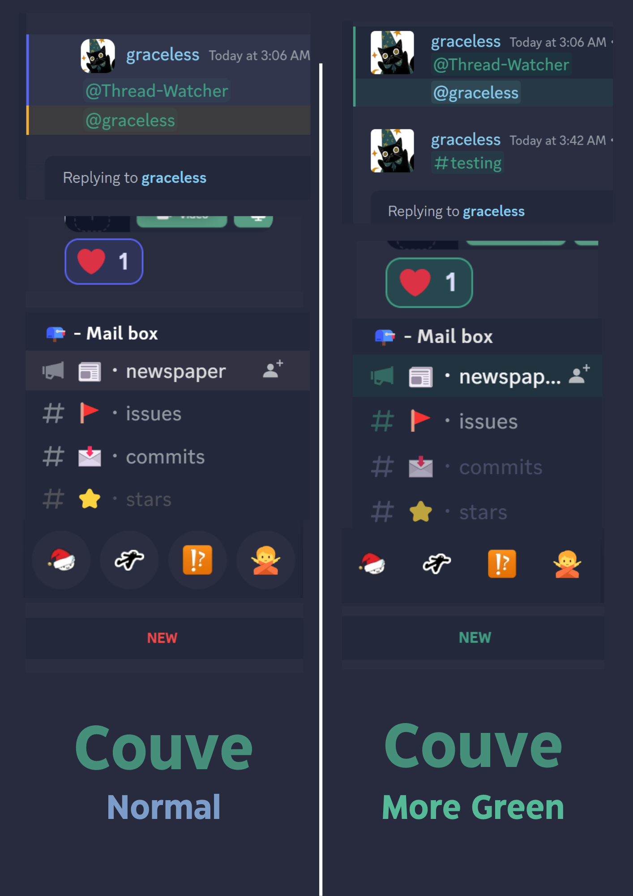

# QuickCSS Snippets

> [!NOTE]  
> ***Works as of March 2024***

### Go here if you just want to use my snippets: https://github.com/Redundakitties/quickCSS-snippets/tree/main/snippets

## Couve Tweaks 
> [!WARNING]  
> ***Has since been deprecated***

The Folder [EverythingAtOnce](https://github.com/Redundakitties/quickCSS-snippets/tree/master/EverythingAtOnce) includes all the snippets in the snippets folder applied to my theme. There is now a README detailing what each snippet does. Only took me an entire year. 

The Folder [OnlyCouveTweaks](https://github.com/Redundakitties/quickCSS-snippets/tree/master/OnlyCouveTweaks) is what you want to use. I've copied and pasted everything in Couve's original [app.css](https://github.com/NYRI4/Couve/blob/main/betterdiscord/app.css) file and commented at the very top. All of my changes you can see in the following image, and hopefully followable so you can tweak to your liking :) 

## Setup
### If you DO have a theme already installed:
1. Add the contents of this file to the bottom of your theme
<a href="https://raw.githubusercontent.com/Redundakitties/quickCSS-snippets/master/OnlyCouveTweaks/theme_snippets.css"><code>./OnlyCouveTweaks/theme_snippets.css</code></a>

2. Also comment out anything involving `.wrapper-1ZcZW-`, these are on lines [81-104](https://github.com/NYRI4/Couve/blob/c43f6f3364e41aa775b5038baddee2ff8144bead/betterdiscord/app.css#L81-L104) in the original app.css file. That should bring back RoleColorEverywhere. 

### If you DON'T have a theme already installed:

For Vencord

Either:
a) copy and paste this code from 
<a href="https://raw.githubusercontent.com/Redundakitties/quickCSS-snippets/master/OnlyCouveTweaks/quickCss.css"><code>./OnlyCouveTweaks/quickCss.css</code></a> into your <code>quickCss.css</code> file found here: <code>C:\Users\&lt;name&gt;\AppData\Roaming\Vencord\settings\quickCss.css</code>
 
OR
  
b) paste this link <code>https://raw.githubusercontent.com/Redundakitties/quickCSS-snippets/master/OnlyCouveTweaks/quickCss.css</code> into the theme section in your settings like you would any other theme.

For BetterDiscord

copy and paste this code from
<a href="https://raw.githubusercontent.com/Redundakitties/quickCSS-snippets/master/OnlyCouveTweaks/quickCss.css"><code>./OnlyCouveTweaks/quickCss.css</code></a> into your css file.

### Credits
- Credits go to [NYRI4](https://github.com/NYRI4/Couve), who I originally found this theme from. 
- Some of these tweaks are from HereToHelp from the [Comfy Discord server](https://discord.gg/comfy-camp-811203761619337259) 
