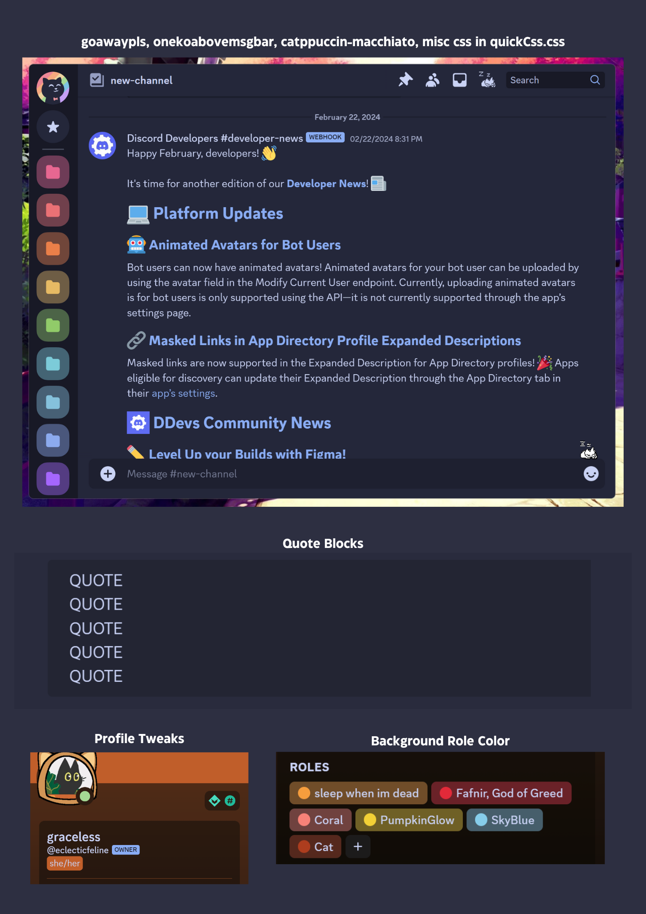
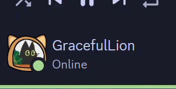

# snippets
> [!NOTE]  
> Channel sidebar is hidden only for this screenshot, it is not collapsed by default

<a href="https://github.com/Redundakitties/quickCSS-snippets/blob/main/snippets/goawaypls.css">goawaypls.css</a>   

- hides icons in upper toolbox (threads, Help, Video Call, Notification Settings)
  
- removes a few section dividers, recolors message dividers to be less obtrusive except unreads

- no more sticker picker in emoji picker

- removes protip from quickswitcher

- hides gift, gif picker, and sticker picker from chat bar

- hides store from sidebar

- hides watermark in upper left

**Border Color**

**Settings Collapse**

