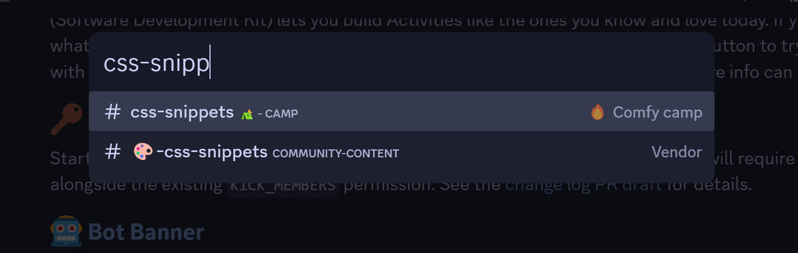

# snippets
> [!NOTE]  
> Channel sidebar is hidden only for this screenshot, it is not collapsed by default

<a href="https://github.com/Redundakitties/quickCSS-snippets/blob/main/snippets/goawaypls.css">goawaypls.css</a>   

- hides icons in upper toolbox (Threads, Help, Video Call, Notification Settings)
  
- removes a few section dividers, recolors message dividers to be less obtrusive except unreads

- no more sticker picker in emoji picker

- removes protip from quickswitcher

- hides gift, gif picker, and sticker picker from chat bar

- hides store and friend tab from sidebar

- hides watermark in upper left

<a href="https://github.com/catppuccin/discord/blob/main/themes/macchiato.theme.css">Catppuccin</a>   

  

<a href="https://github.com/Redundakitties/quickCSS-snippets/blob/main/2024/catppuccin-tweaks.css">catppuccin-tweaks.css</a>

- main quickCSs.css file, imports all the other snippets along with a handful of constantly changing snippets like the following
  
 - Reordered my search bar to be on the far right

 - Recolored the magnifying glass

 - H1 and H2 are colored with macchiato's accent color (  #8aadf4 )

 - set home icon to be catppuccino

 - lowered text area a few pixels

<a href="https://github.com/Redundakitties/quickCSS-snippets/blob/main/snippets/blockQuotes.css">blockQuotes.css</a>

  
- cleans up quote blocks
  

<a href="https://github.com/Redundakitties/quickCSS-snippets/blob/main/snippets/profiletweaks.css">profiletweaks.css</a>

  
- colors pronouns (must have FakeProfileThemes enabled) to match profile color

- colors divider to match profile color

- adds back @ in front of usernames
  

<a href="https://github.com/Redundakitties/quickCSS-snippets/blob/main/snippets/bgRoleColor.css">bgRoleColor.css</a>

  
- prettily colors the bg of roles
  

** **

**Border Color - [borderchange](https://github.com/Redundakitties/quickCSS-snippets/blob/main/snippets/borderchange.css)**

**Settings Collapse - [micsettingdrawer.css](https://github.com/Redundakitties/quickCSS-snippets/blob/main/snippets/micsettingsdrawer.css)**

**QuickSwitcher v2 - [quickSwitcher](https://github.com/Redundakitties/quickCSS-snippets/blob/main/snippets/quickSwitcher.css)**

